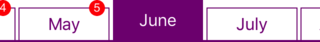

# PageMenuKitSwift

[PageMenuController](https://github.com/magickworx/PageMenuController)  Swift。

A class of the user interface that displays the side scroll menu screen used in news applications and its contents. Since Xcode's complete set of projects are registered, you can check the operation on the simulator if you run it.

When reimplementing with Swift 3, we redesigned the class to be versatile and easy to extend. Since only the appearance of the page menu is different, we implemented a subclass of PMKPageMenuItem for each style and used it. Therefore, you can easily add custom menus.

## Installation

```
pod 'PageMenuKitSwift'
```


## How to use PageMenuKit.framework

Running Build with Xcode's Build Target with PageMenuKitFatBinary creates PageMenuKit.framework. This is set in Project of Xcode of homebrew application.

After that, write the following code and use it.

```Swift
class RootViewController: UIViewController
{
  var pageMenuController: PMKPageMenuController? = nil

  override func viewDidLoad() {
    super.viewDidLoad()

    var controllers: [UIViewController] = []
    let dateFormatter = DateFormatter()
    for month in dateFormatter.monthSymbols {
      let viewController: DataViewController = DataViewController()
      viewController.title = month
      controllers.append(viewController)
    }

    let statusBarHeight: CGFloat = UIApplication.shared.statusBarFrame.size.height
    /*
     * Available menu styles:
     * .Plain, .Tab, .Smart, .Hacka, .Ellipse, .Web, .Suite, .NetLab and .NHK
     * See PMKPageMenuItem.swift in PageMenuKit folder.
     *
     * menuColors: [] means that we will use the default colors
     */
    pageMenuController = PMKPageMenuController(controllers: controllers, menuStyle: .Smart, menuColors: [], topBarHeight: statusBarHeight)
    self.addChildViewController(pageMenuController!)
    self.view.addSubview(pageMenuController!.view)
    pageMenuController?.didMove(toParentViewController: self)
  }
}
```

For more detailed code look at RootViewController.swift in PageMenuKitDemo.


## Available Menu Styles

### .Plain
[News path](https://itunes.apple.com/jp/app/id1106788059?mt=8)  like menu screen


### .Tab
[Gnochey](https://itunes.apple.com/jp/app/id590384791?mt=8) like menu screen


### .Smart
[SmartNews](https://itunes.apple.com/jp/app/id579581125?mt=8) like menu screen


### .Hacka
[Hacka Doll](https://itunes.apple.com/jp/app/id888231424?mt=8) like menu screen


### .Ellipse
[JCnews](https://itunes.apple.com/jp/app/id1024341813?mt=8) like menu screen


### .Web
[JCnews website website](https://jcnews.tokyo/) like menu screen


### .Suite
[NewsSuite](https://itunes.apple.com/jp/app/id1176431318?mt=8) like menu screen (background color is gradation)


### .NetLab
[Netorabo](https://itunes.apple.com/jp/app/id949325541?mt=8) like menu screen


### .NHK
[NHK News · Disaster Prevention](https://itunes.apple.com/jp/app/id1121104608?mt=8) like menu screen


## Examples

Specifying [] for menuColors of the initializer of PMKPageMenuController sets the default color scheme. Here, an example of changing the color for each style is shown.

### .Plain, .Hacka, .Ellipse, .NHK 

.Plain, .Hacka, .Ellipse, .NHK styles can specify only one color. In the following example, purple (.purple) is set to .Plain style .

```swift
pageMenuController = PMKPageMenuController(controllers: controllers, menuStyle: .Plain, menuColors: [ .purple ], topBarHeight: statusBarHeight)
```
#### .Plain


#### .Hacka



#### .Ellipse


#### .NHK


### .Tab, .Smart

.Tab, .Smart style can specify one or more colors. In the following example, red, orange, yellow, green, blue, purple are set in. Tab style . If the number of menus is larger than the number of colors, colors are applied in order.

```swift
pageMenuController = PMKPageMenuController(controllers: controllers, menuStyle: .Tab, menuColors: [ .red, .orange, .yello, .green, .blue, .purple ], topBarHeight: statusBarHeight)
```

#### .Tab


#### .Smart


### .Web

As with the .Tab, .Smart style, Web styles can be specified with one or more colors. However, the background color is currently fixed. Also, in the current implementation, the color specified at the beginning is the color of the boundary line.

In the following example, red, orange, yellow, green, blue, purple are set for Web style . If the number of menus is larger than the number of colors, colors are applied in order.

```swift
pageMenuController = PMKPageMenuController(controllers: controllers, menuStyle: .Web, menuColors: [ .red, .orange, .yello, .green, .blue, .purple ], topBarHeight: statusBarHeight)
```


### .Suite
Although there is only one color that can be specified with the Suite style, the color of the indicator is only changed at present. In the following example, blue (.blue) is set for the Suite style .

```swift
pageMenuController = PMKPageMenuController(controllers: controllers, menuStyle: .Suite, menuColors: [ .blue ], topBarHeight: statusBarHeight)
```


### .NetLab

Only one color can be specified in .NetLab style. Currently, it affects the color of characters when not selected. In the following example, red ( . Red) is set for .NetLab style .

```swift
pageMenuController = PMKPageMenuController(controllers: controllers, menuStyle: .NetLab, menuColors: [ .red ], topBarHeight: statusBarHeight)
```


## Delegate Methods (optional)

It is also possible to use Delegate which is called when switching pages.

```swift
pageMenuController?.delegate = self
```

Add the above description and implement the following methods as necessary. At the moment, I use it only when displaying a .Hacka style badge.

```PMKPageMenuControllerDelegte.swift
public protocol PMKPageMenuControllerDelegate: class
{
  // Called before switching by swipe operation on page screen
  func  pageMenuController ( _  pageMenuController : PMKPageMenuController, willMoveTo  viewController : UIViewController, at  menuIndex : Int )
   // Called when page switching is complete
  func pageMenuController(_ pageMenuController: PMKPageMenuController, didMoveTo viewController: UIViewController, at menuIndex: Int)

  // Called when creation of menu item etc. is completed
  func  pageMenuController ( _  pageMenuController : PMKPageMenuController, didPrepare  menuItems : [PMKPageMenuItem])
   // Called when the menu is tapped
  func pageMenuController(_ pageMenuController: PMKPageMenuController, didSelect menuItem: PMKPageMenuItem, at menuIndex: Int)
}
```

## References

Also look at the implementation of PageMenuKit, the user interface of [Qiita's news applications](http://qiita.com/magickworx/items/5de63eb926a9447b2665) . It also describes how to implement custom menus.

## Requirements

 - Swift 4
 - iOS 11.0 or later
 - Xcode 9.0 or later

## All

 - .Suite, .Web and .NetLab style customization method

## Credits
Since there is no Cocaopod installation option and no English Readme for the original repo [PageMenuKitSwift](https://github.com/magickworx/PageMenuKitSwift), I have create an Cocaopod and English Readme. All credits goes to original repo [PageMenuKitSwift](https://github.com/magickworx/PageMenuKitSwift) and owner [Kouichi ABE](https://github.com/magickworx).

